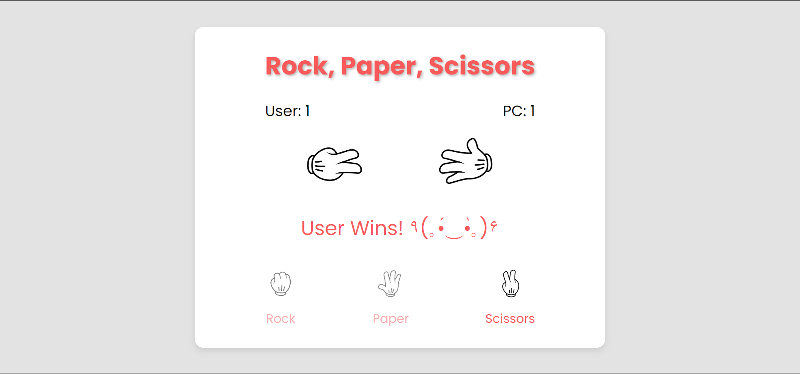
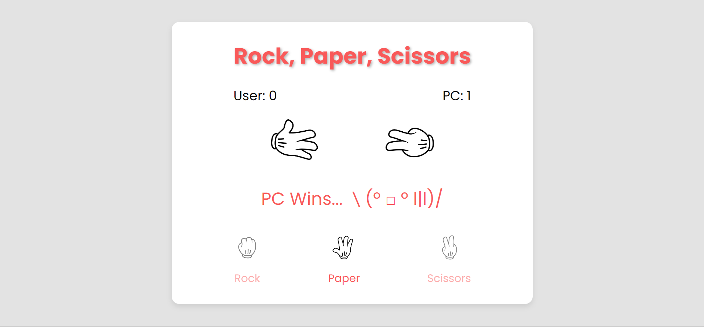
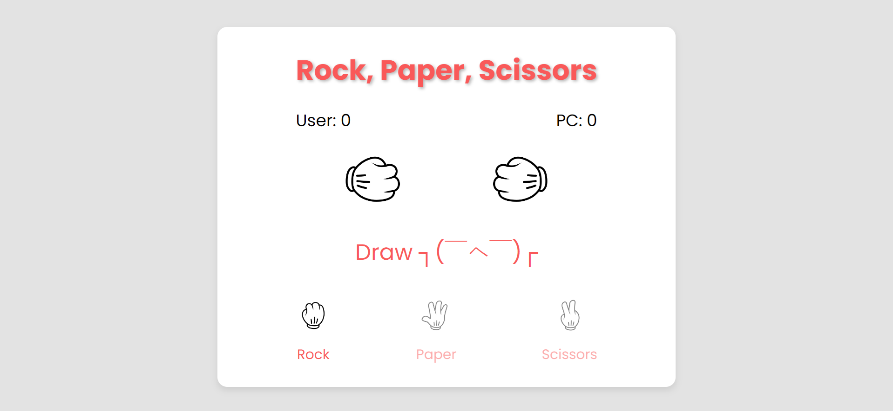

# Rock, Paper, Scissors Game 🎮

This is a simple and fun **Rock, Paper, Scissors** game built using HTML, CSS, and JavaScript. Play against the computer, where 9 different kaomojis (Japanese emoticons) appear based on the result of each round, adding more fun to the experience!

## How to Play
1. Click on **Rock**, **Paper**, or **Scissors** to make your choice.
2. The computer will randomly select its choice.
3. After a brief animation, the result will be displayed along with a unique kaomoji based on the outcome:
   - **User Wins!**
   - **PC Wins...**
   - **Draw**

## Kaomoji Outcomes
There are 9 different possible outcomes depending on the combination of your and the PC's choices:
| User's Choice  | PC's Choice      | Outcome        | Kaomoji                                   |
|----------------|------------------|----------------|-------------------------------------------|
| Rock           | Rock             | Draw           | `Draw ┐(￣ヘ￣)┌`                         |
| Rock           | Paper            | PC Wins        | `PC Wins... (」°ロ°)」`                   |
| Rock           | Scissors         | User Wins      | `User Wins! °˖✧◝(⁰▿⁰)◜✧˖°`             |
| Paper          | Paper            | Draw           | `Draw ┐(￣ヮ￣)┌`                         |
| Paper          | Rock             | User Wins      | `User Wins! ＼(＾▽＾)／`                |
| Paper          | Scissors         | PC Wins        | `PC Wins... ＼(º □ º l\|l)/`              |
| Scissors       | Scissors         | Draw           | `Draw ┐( ˘ ､ ˘ )┌`                       |
| Scissors       | Paper            | User Wins      | `User Wins! ٩(｡•́‿•̀｡)۶`                |
| Scissors       | Rock             | PC Wins        | `PC Wins... (╥﹏╥)`                      |

## Game Screenshots

### User Wins


### PC Wins


### Draw


## Features
- **Real-Time Score Tracking**: Both user and PC scores are updated after each round.
- **Fun Kaomoji Emotes**: 9 different kaomojis for varied gameplay reactions.
- **Animations**: Shaking animations before the result is revealed, adding to the excitement.
- **Responsive Design**: The game works well on different screen sizes.
  
## Technologies Used
- **HTML**: Provides the structure of the game.
- **CSS**: Adds styling, layout, and animations to the game.
- **JavaScript**: Handles the game logic, result calculation, and DOM manipulation.

## How to Run the Game
1. Clone this repository:  
   ```bash
   git clone https://github.com/megamiii/RockPaperScissorsGame.git
   ```
2. Navigate to the project directory:
   ```bash
    cd RockPaperScissorsGame
   ```
3. Open index.html in your preferred web browser to start playing.